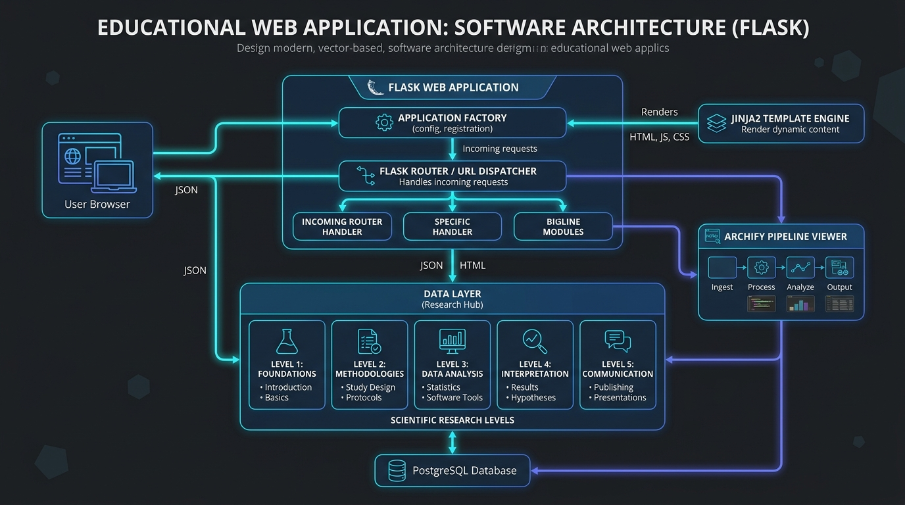

# 🏗️ Arquitectura del Sistema & Pipeline Archify

Este documento describe la arquitectura de software, los flujos de datos y la organización técnica del proyecto **InvestigaLab**, estructurado bajo las buenas prácticas del repositorio de referencia [Archify](https://github.com/tt-a1i/archify.git).

---

## 🖼️ Diagrama Visual de Arquitectura

El diagrama general de componentes se encuentra guardado en `docs/images/arquitectura.png`:



---

## 📊 Diagrama de Flujo y Componentes (Mermaid)

```mermaid
graph TD
    Client([🌐 Navegador Web / Estudiante]) -->|Petición HTTP| FlaskRouter[⚡ Enrutador Flask (app/routes.py)]
    
    subgraph Web_Tier [Capa Web & Controladores]
        FlaskRouter --> IndexController["/ (Landing Page)"]
        FlaskRouter --> LevelsController["/niveles & /niveles/:id"]
        FlaskRouter --> PipelineController["/pipeline (Archify View)"]
        FlaskRouter --> MatrizController["/matriz (Constructor Científico)"]
        FlaskRouter --> ApiController["/api/pipeline-data (JSON API)"]
    end

    subgraph Data_Tier [Capa de Datos Desacoplada]
        LevelsController --> LevelData[📚 app/data/levels_data.py]
        PipelineController --> PipelineData[🛠️ app/data/pipeline_data.py]
        ApiController --> PipelineData
    end

    subgraph Presentation_Tier [Capa de Presentación Jinja2 + Frontend]
        IndexController --> JinjaEngine[🎨 Motor Jinja2]
        LevelsController --> JinjaEngine
        PipelineController --> JinjaEngine
        MatrizController --> JinjaEngine
        
        JinjaEngine --> HTMLOutputs[📄 Documentos HTML5 Base + Vistas]
        HTMLOutputs --> CSS_JS[📦 style.css + main.js + Assets]
    end

    CSS_JS --> Client
```

---

## 🔄 El Pipeline de Ejecución (Inspiración Archify)

Siguiendo el estándar de diseño de pipelines de software:

| # | Etapa | Componente Responsable | Entrada (Inputs) | Salida (Outputs) |
|---|---|---|---|---|
| **1** | **Dispatcher** | `run.py` -> `app/__init__.py` | Request HTTP (GET/POST) | Contexto de Ejecución Flask |
| **2** | **Routing & Logic** | `app/routes.py` | Parámetros de Ruta / Query | Invocación de Data Providers |
| **3** | **Data Provision** | `app/data/levels_data.py` | IDs de nivel (`principiante`, etc.) | Objetos estructurados de datos |
| **4** | **Rendering** | `Jinja2` (`app/templates/`) | Modelos de datos + Plantillas | HTML5 dinámico compilado |
| **5** | **Client Hydration** | `app/static/js/main.js` | Eventos de usuario en DOM | Matrices en vivo, copiado, tabs |

---

## 🔬 El Pipeline Metodológico de Investigación

Paralelamente a la arquitectura de software, el dominio científico se modela como un pipeline de 5 etapas secuenciales:


1. **Fase 1 (Principiante):** Curiosidad empírica, árbol de problemas y formulación de preguntas no dicotómicas.
2. **Fase 2 (Básico):** Búsqueda con operadores booleanos, revisión de literatura, objetivos SMART e hipótesis $H_0 / H_1$.
3. **Fase 3 (Intermedio):** Enfoque (cuanti/cuali/mixto), cálculo muestral ($Z, e$) y matriz de operacionalización (VI/VD).
4. **Fase 4 (Avanzado):** Confiabilidad (Alfa de Cronbach), validación de jueces (V de Aiken) y pruebas inferenciales (t-Student, Mann-Whitney, ANOVA).
5. **Fase 5 (Experto):** Estructura IMRyD, comités de bioética, selección de revistas (Scopus/WoS) y respuesta a revisores.

---

## 💡 Separación Arquitectónica: "Idea vs. Técnica"

La mayor virtud de esta arquitectura es el **desacoplamiento total**:

* **Para modificar el contenido del curso:** Solo editas `app/data/levels_data.py`.
* **Para cambiar el dominio del proyecto (ej. a Gestión de Inventario o Clínica Veterinaria):**
  1. Reemplazas los diccionarios en `app/data/` con tus productos, categorías o servicios.
  2. Ajustas los títulos en `app/templates/index.html`.
  3. **Todo el backend de Flask, el sistema de rutas, la configuración del entorno virtual y los assets de CSS/JS se mantienen 100% intactos.**
