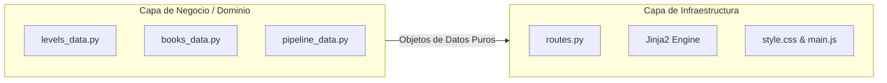

# 🏛️ 01. Arquitectura de Software y Patrones de Diseño en Flask

Este documento detalla la arquitectura de software, los principios de diseño y los patrones arquitectónicos implementados en **InvestigaLab**, garantizando una separación estricta de responsabilidades, alta cohesión y bajo acoplamiento.

---

## 🎯 1. Patrón Application Factory (`create_app`)

En aplicaciones profesionales de Flask, se evita crear la instancia `app = Flask(__name__)` en el ámbito global del módulo principal. En su lugar, se implementa una función fábrica:

```python
# app/__init__.py
from flask import Flask

def create_app(config_name=None):
    """
    Factoría de la aplicación Flask.
    Permite instanciar múltiples aplicaciones con configuraciones distintas
    (desarrollo, testing, producción) y facilita las pruebas unitarias.
    """
    app = Flask(__name__)
    
    # Inyección de configuraciones
    app.config["SECRET_KEY"] = "investigalab-secret-key-2026-educativa"
    app.config["JSON_AS_ASCII"] = False

    # Registro modular de Blueprints
    from app.routes import main_bp
    app.register_blueprint(main_bp)

    return app
```

### Ventajas del Patrón Factory:
1. **Aislamiento en Pruebas:** Permite crear clientes de prueba independientes (`app.test_client()`) sin estado mutable compartido.
2. **Inyección de Configuración:** Facilita alternar entre entornos (`DevelopmentConfig`, `TestingConfig`, `ProductionConfig`).
3. **Prevención de Importaciones Circulares:** La inicialización de extensiones y rutas ocurre de forma ordenada.

---

## 🧩 2. Modularización con Blueprints

Flask utiliza **Blueprints** para organizar rutas y vistas en módulos lógicos independientes:

```python
# app/routes.py
from flask import Blueprint, render_template, abort

main_bp = Blueprint("main", __name__)

@main_bp.route("/niveles/<level_id>")
def levels(level_id):
    # Lógica del controlador...
```

* **Escalabilidad:** A medida que la aplicación crezca, se pueden añadir nuevos Blueprints (ej. `auth_bp`, `api_bp`, `admin_bp`) sin modificar el enrutador principal.
* **Prefijos de URL:** Cada Blueprint puede encapsular prefijos de ruta (ej. `/api/v1`) y manejadores de error específicos.

---

## 🧠 3. Separación Dominio vs. Infraestructura ("Idea vs. Técnica")

Uno de los principios de diseño más importantes de InvestigaLab es el desacoplamiento entre:



1. **Capa de Dominio (`app/data/`):** Contiene los datos puros (estructuras de datos de Python, diccionarios, objetos inmutables) sobre los 5 niveles científicos y libros clásicos. **No depende de Flask**.
2. **Capa Web (`app/routes.py` y `app/templates/`):** Gestiona el protocolo HTTP, las plantillas Jinja2 y la interacción en el navegador.

> 💡 **Principio de Sustitución:** Si mañana se desea transformar esta aplicación a una plataforma de inventario o a una API móvil, solo se reemplaza `app/data/`, manteniendo el 100% de la infraestructura técnica de Flask intacta.
