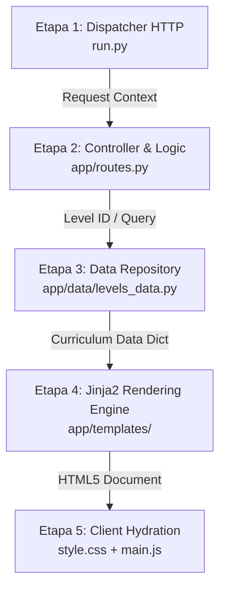

# 🔄 06. Especificación del Pipeline de Arquitectura (Inspiración Archify)

Este documento detalla la integración de los principios de diseño de **[Archify](https://github.com/tt-a1i/archify.git)** para la trazabilidad de pipelines y desacoplamiento de software en **InvestigaLab**.

---

## 🏗️ 1. Concepto de Pipeline Arquitectónico

Un **Pipeline de Software** es una secuencia lineal o acíclica de etapas de procesamiento donde la salida (*Output*) de cada etapa sirve como entrada (*Input*) validada para la siguiente.

En InvestigaLab existen dos pipelines coordinados:
1. **Pipeline de Ejecución Web (Infraestructura Flask)**.
2. **Pipeline Metodológico de Investigación (Dominio Científico)**.

---

## ⚡ 2. Mapeo de Etapas del Pipeline Web



### Contratos de Datos por Etapa:

| Etapa | Componente | Inputs | Outputs | Contrato de Validación |
|---|---|---|---|---|
| **1. Dispatcher** | `run.py` | Petición HTTP cruda | Contexto WSGI Flask | `HTTP Method in ['GET', 'POST']` |
| **2. Controller** | `app/routes.py` | Parámetros de ruta | Modelo de vista | `level_id in VALID_LEVEL_IDS` |
| **3. Data Layer** | `app/data/` | Consultas tipadas | Diccionarios inmutables | Estructura de Módulos & Quizzes |
| **4. Rendering** | `Jinja2` | Datos + Plantilla | HTML5 dinámico | Escapado XSS automático |
| **5. Client** | `main.js` | Eventos del DOM | Renderizado reactivo | Consistencia lógica VI/VD |

---

## 🔬 3. Mapeo del Pipeline Científico

```text
[Observación / Vacío] ──► [Marco Teórico & Hipótesis] ──► [Diseño & Muestreo] ──► [Estadística & Contraste] ──► [IMRyD & Peer Review]
       (Nivel 1)                    (Nivel 2)                   (Nivel 3)                  (Nivel 4)                    (Nivel 5)
```

Cada etapa científica produce un entregable auditable que se valida contra las normas internacionales de publicación científica (APA 7ma / IMRyD / COPE).
